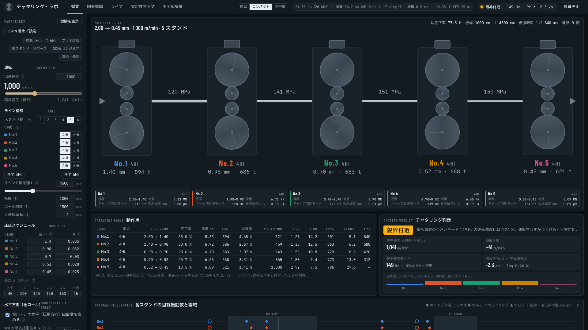
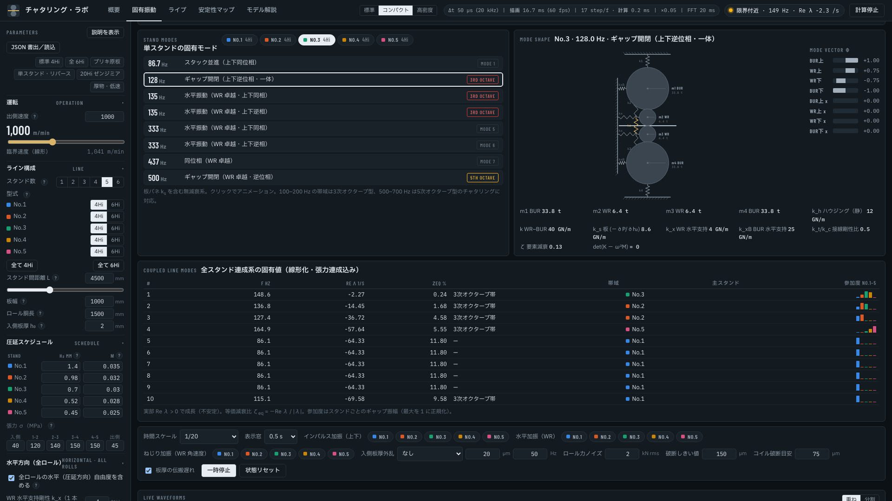
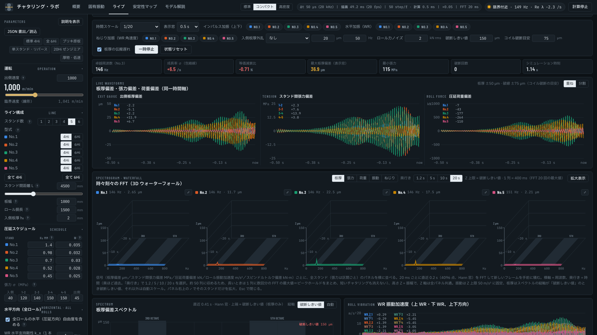
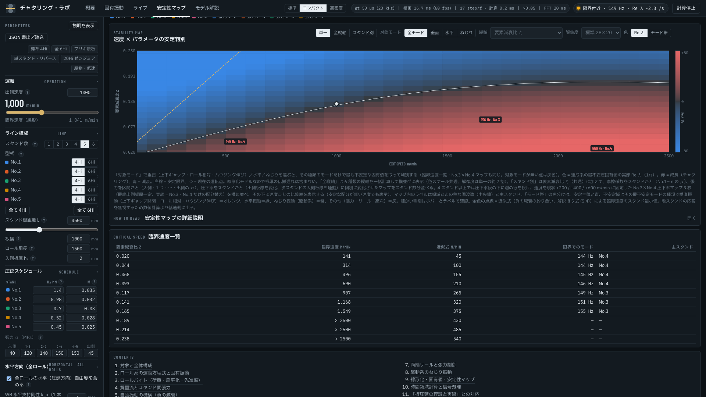
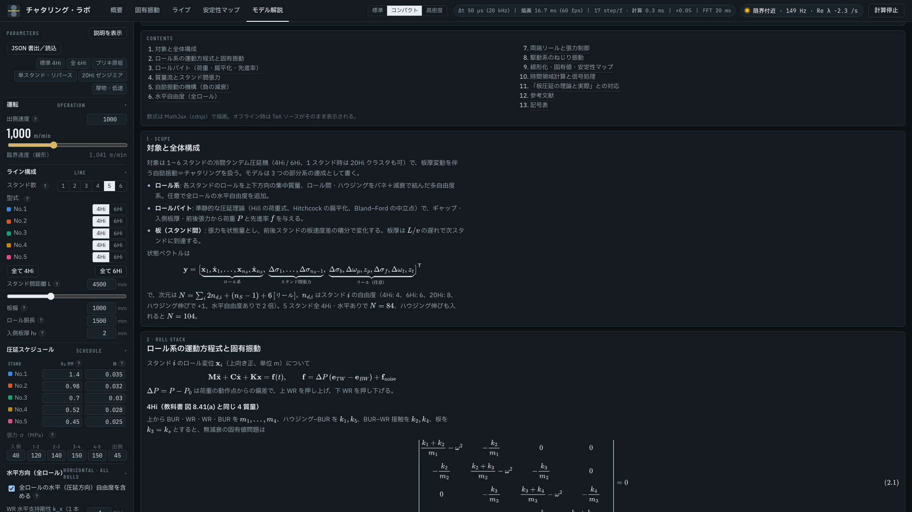

# Tandem Chatter Lab — チャタリング・ラボ

冷間タンデム圧延機（1〜6 スタンド、4Hi / 6Hi、1 スタンドなら 20Hi ゼンジミアも）の**チャタリング**（板厚変動を伴う自励振動）を、
ブラウザだけで調べるアプリ。ロール系の多自由度振動・ロールバイトの圧延理論・スタンド間張力を連成させ、
**固有値で安定限界（臨界速度）を求め**、**時間領域で振動が育つ様子をライブで見る**。



## できること

- **動作点**: 各スタンドの圧延荷重（Hill の式 + Hitchcock の扁平化）、先進率（Bland–Ford の中立点。中立点がバイトの外なら SKID）、
  板バネ剛性 k_s = −∂P/∂h₂、スタンド間張力、伝搬時間
- **チャタリング判定**: 全スタンド連成系の固有値から、最も減衰の小さいモードの周波数・成長率 Re λ・等価減衰比、
  臨界速度（Re λ = 0 になる出側速度）と今の速度の余裕
- **固有振動**: 単スタンドのロール系の固有モード（スタック並進・ギャップ開閉・水平・高次）をアニメーションで、
  連成系の固有値の一覧（3 次オクターブ帯 100–200 Hz・5 次オクターブ帯 500–700 Hz の色分け、スタンドごとの参加度）
- **ライブ計算**: 4 次 Runge–Kutta（Δt 50 µs）で時間積分し、板厚・張力・荷重の偏差、WR の振動加速度、WR の水平変位、
  スピンドルトルクを同じ時間軸で。インパルス・水平・ねじり加振、入側板厚外乱（正弦波・ランダム・矩形）、ロール力ノイズ、
  板厚の伝搬遅れ、破断（しきい値で再通板）。スペクトルと 3D ウォーターフォール（スペクトログラム）
- **安定性マップ**: 出側速度 × パラメータ（要素減衰比 ζ・摩擦係数・張力・スタンド間距離・ハウジング剛性・板幅）の格子で
  連成系を線形化して固有値を解き、安定限界（白線）とモードの種類（垂直・水平・ねじり）を色で。スタンド別のマップ、
  4 スタンド以上では No.3 × No.4 の圧下率の配分替えのマップも
- **オプションの自由度**: 全ロールの水平（圧延方向）自由度、ハウジングの伸び変形（クロスヘッド質量）、駆動系のねじり振動
  （電動機–スピンドル–WR の 3 慣性、がた、速度 PI 制御）、両端リール（ペイオフ / テンション、張力 PI 制御。単スタンド・リバースミル）
- **プリセット**: 標準 4Hi・全 6Hi・ブリキ原板（6Hi、薄物・高速）・単スタンド・リバース・20Hi ゼンジミア・厚物・低速。
  条件は JSON で書き出し / 読み込み
- **モデル解説**: 式と教科書（『板圧延の理論と実際』）との対応、参考文献、記号表をアプリの中に（MathJax で数式）

| 固有振動 | ライブ計算 |
|---|---|
|  |  |
| **安定性マップ** | **モデル解説** |
|  |  |

## 使い方

`dist/chatter-lab.html` をブラウザで開くだけ（1 ファイル。インストール不要）。
行列計算の [ml-matrix](https://github.com/mljs/matrix)、数式の MathJax、フォントを CDN から読むので、インターネットに繋がっている必要がある
（MathJax が無いと数式は TeX のまま表示される）。

1. 左の「パラメータ」で条件を選ぶ（プリセットのボタン、または各欄）。変更はすぐに反映される
2. 「概要」で動作点とチャタリング判定を見る。「臨界速度（線形）」が今の出側速度より上なら安定
3. 「ライブ」で出側速度を臨界速度より上げると、3 次オクターブ帯の振動が育って板厚偏差が破断しきい値に届く
4. 「安定性マップ」で、どのパラメータを変えると安定限界がどちらへ動くかを見る

## モデル（要約）

詳しくはアプリの「モデル解説」のタブ（`src/doc.html`）。

- **ロール系**: 各スタンドのロールを上下方向の集中質量の直列系（4Hi は BUR–WR–WR–BUR の 4 質量、6Hi は IMR を入れた 6 質量、
  20Hi はクラスタを荷重経路に沿って 8 質量に集約）とし、ハウジング・ロール間の接触をバネと減衰（要素ごとの減衰比 ζ）で結ぶ。
  固有値問題 det(K − ω²M) = 0（教科書の式 (8.35)–(8.37) と同形）
- **ロールバイト**（準静的）: 流動応力 k = (2/√3) K (ε₀ + ε)ⁿ、Hill の荷重式 P = w l Q_p (k̄ − σ̄)、Hitchcock の扁平化、
  Bland–Ford の中立点と先進率
- **スタンド間**: 張力 dσ/dt = (E/L)(v_in,i+1 − v_out,i)、質量流一定 v_in h₁ = v_out h₂ + κ l ḣ₂、板厚は L / v の遅れで次のスタンドへ
- **自励の機構**: ギャップが開閉すると入側速度が変わり、後方張力が積分的に変わって荷重がギャップ速度と同相に変わる = 負の減衰
  c_eq = −G/ω²。G は速度に比例し、構造減衰との和が負になる速度が臨界速度。ω² に反比例するので、上下逆位相の低次の
  ギャップ開閉モード（100–200 Hz、3 次オクターブ）が最初に不安定になる
- **安定判別**: 非線形の状態方程式を動作点まわりで中心差分で線形化し、バランシング + Hessenberg–QR で固有値。max Re λ > 0 で不安定
- **限界**: AGC・張力制御の遅いループ、摩擦係数の速度依存、油膜、ロール偏心、ハウジングの多次元モードは入っていない。
  減衰比 ζ は最も不確かな量で、臨界速度を実機に合わせる調整代（既定 0.13）

## 開発

```bash
cd src
node build.js            # src/ の page.html・style.css・model.js・app.js・doc.html を 1 ファイルに → dist/chatter-lab.html
```

テストは ml-matrix の UMD 版を `src/mlmatrix.umd.js` に置いてから（`.gitignore` 済み）:

```bash
curl -sSfL -o src/mlmatrix.umd.js https://cdn.jsdelivr.net/npm/ml-matrix@6.11.1/matrix.umd.js
node src/test_check.js   # 合否を判定するチェック（どれか FAIL で exit 1）
node src/test_model.js   # 動作点・固有値・臨界速度などを表示するスモーク
node src/test_sim.js     # 減衰比と臨界速度、時間領域の計算を表示するスモーク
```

`test_check.js` が見るもの: 既定の 5 スタンド 4Hi の荷重・先進率・板バネ剛性、ギャップ開閉モードが 3 次オクターブ帯にあること、
1000 m/min で安定・臨界速度 1041 m/min ± 5 %、6Hi は 4Hi より安定・減衰が小さいと臨界速度が下がること、
臨界速度を超えると振動が育つこと・NaN で破断して戻ること、スペクトルのピークが 3 次オクターブ帯にあること。
壊した版（減衰を 1/4、Hill の Q_p の定数を変える）で FAIL することを確かめてある。

CI（`.github/workflows/test.yml`）が push のたびに、ml-matrix を版とハッシュを固定して取り、ビルドして
`dist/chatter-lab.html` がコミットされたものと同じか確かめ、`test_check.js` と 2 つのスモークを回す。

| 場所 | 中身 |
|---|---|
| `src/model.js` | 物理モデル（`ChatterModel`: `defaultParams`・`Line`（動作点・固有モード）・`eigenAnalysis`・`Sim`（時間積分）・`spectrum`） |
| `src/app.js` | 画面（パラメータ・描画・安定性マップ・ライブ） |
| `src/page.html`・`style.css`・`doc.html` | 画面の骨組み・見た目・モデル解説 |
| `src/build.js` | 1 ファイルにまとめる |
| `dist/chatter-lab.html` | ビルド結果（ブラウザで直接開く） |
| `dist/mobile.html` | 狭い画面・広い画面で並べて見る確認用（`dist/test.html` を読む。`test.html` は `build.js` が作る） |

## 参考文献

- 日本鉄鋼協会 編『板圧延の理論と実際』第 8 章 §8.4.2 チャタリング、§8.4.3 スリップ現象（pp. 204–205）、第 9 章 §9.4.3–9.4.4 駆動系動特性（pp. 236–237）
- R. Hill, *The Mathematical Theory of Plasticity*, Oxford, 1950
- D. R. Bland and H. Ford, "The calculation of roll force and torque in cold strip rolling with tensions," Proc. IMechE 159 (1948)
- J. H. Hitchcock, "Roll neck bearings," ASME Research Committee Report, 1935
- I.-S. Yun, W. R. D. Wilson and K. F. Ehmann, "Chatter in the strip rolling process, Parts 1–3," ASME J. Manuf. Sci. Eng. 120 (1998)
- P.-H. Hu and K. F. Ehmann, "A dynamic model of the rolling process, Parts I–II," Int. J. Mach. Tools Manuf. 40 (2000)
- J. Tlusty, G. Chandra, S. Critchley and D. Paton, "Chatter in cold rolling," CIRP Annals 31 (1982)
- B. N. Parlett and C. Reinsch, "Balancing a matrix for calculation of eigenvalues and eigenvectors," Numer. Math. 13 (1969)
